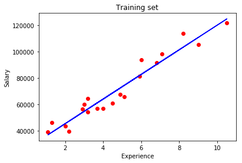
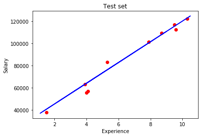

# ExperienceBasedSalaryPridictor
Simple linear regression is useful for finding relationship between two continuous variables. One is predictor or independent variable and other is response or dependent variable. It looks for statistical relationship but not deterministic relationship. 
To get more detailed information about Linear Regression visit https://towardsdatascience.com/linear-regression-detailed-view-ea73175f6e86

This is simple linear regression model that predicts the salary based on the years of experience. This is a linear relation between the two variables. First is the Salary of the person and second is the years of experience that perwon has. 

To show it as example, here are single line plots for training set and the test set.

